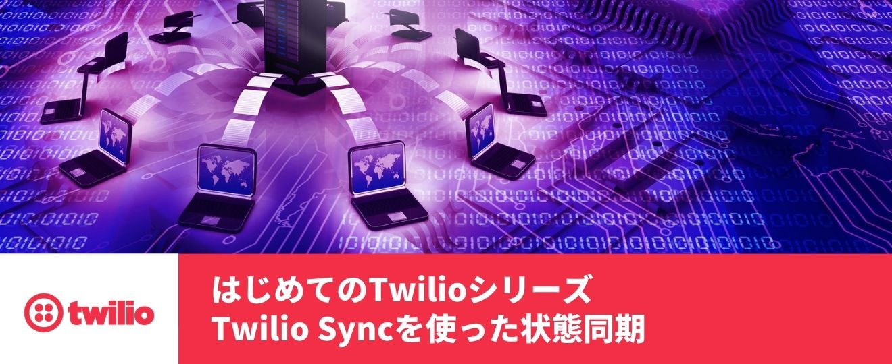

# Twilio-HandsOn-Sync-JP

[Twilio Sync](https://jp.twilio.com/docs/sync)ハンズオン手順書です。

## 必要・推奨環境
このハンズオンを実施する場合は、下記の記事に従いTwilioアカウントの作成が必要となります。

- [Twilioアカウントの作成方法](https://www.twilio.com/blog/how-to-create-twilio-account-jp)

## ハンズオン

- [ハンズオン: Syncサービスの作成および、APIキー/APIシークレットの生成](docs/01-Generate-API-Key-Secret/00-Overview.md)
- [ハンズオン: Twilio Functionsを利用したアクセストークンの生成](docs/02-Generate-Access-Token/00-Overview.md)
- [ハンズオン: Syncをクライアントアプリで利用](docs/03-Sync-Client-App/00-Overview.md)