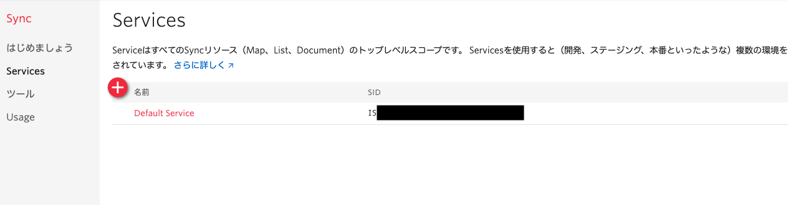
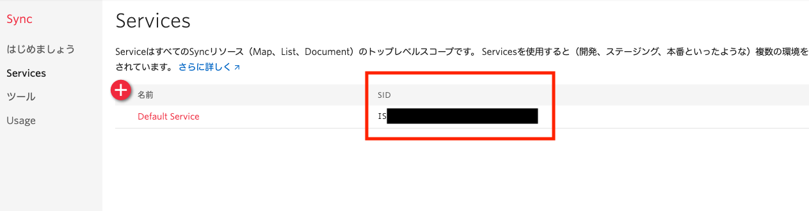

#  手順1: Syncサービスの確認、または作成

この手順ではTwilio Syncサービスをコンソールから作成します。作成した際に生成される`SERVICE SID`を後のハンズオンで使用します。

[コンソール](https://jp.twilio.com/console)から[Sync - Services](https://jp.twilio.com/console/sync/services)を開きます。

`Default Service`が表示されている場合はそちらを利用するか、`+`ボタンをクリックし、新しいサービスを作成します。

その後、サービス一覧の`SID`列の値を記録します。

## 次の手順

[APIキーおよびAPIシークレットの生成](02-Generate-API-Key-Secret.md)