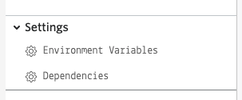
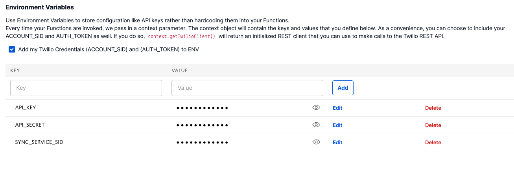
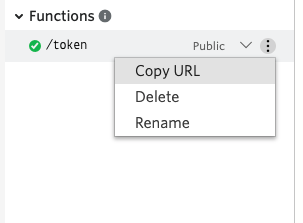
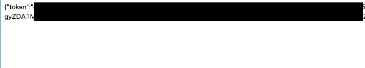
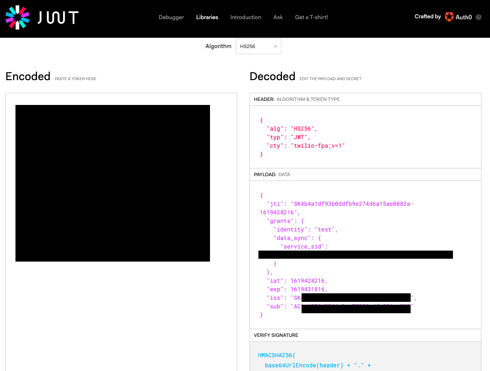

#  手順2: アクセストークンの生成 

この手順ではTwilio Functionを使用し、アクセストークンを生成します。

## 2-1: 環境変数に値を追加

`Settings`の`Environment Variables`を開きます。



この画面では環境変数を指定できます。先ほど控えたそれぞれの値を次の`KEY`名で追加します。

|  KEY  |  VALUEに設定する値  |　
| ---- | ---- |
|  API_KEY  |  APIキーの値  |
|  API_SECRET  |  APIシークレットの値  |
|  SYNC_SERVICE_SID  |  Twilio Syncサービスを作成した際に生成されたSID  |

環境変数を追加すると画面に表示されます。



## 2-2: Twilio Clientの識別子を設定し、Twilio Syncを利用できるアクセストークンを生成

Twilio Clientを利用する場合、識別子が必要となります。今回はリクエストのパラメータをもとに作成します。この実装では渡されたパラメータをそのまま利用しますが、実開発ではランダムな値の付与、また事前にユーザー認証を行い、一意の識別子となるように工夫してください。

`/token`パスを再度表示し、下記のスニペットに従い、識別子とアクセストークン、Sync機能利用の許可（SyncGrant）オブジェクトを取得します。


```js
exports.handler = function(context, event, callback) {
  // 今回追加分
  // リクエストのパラメータとして渡ってきた値を識別子として利用
  const IDENTITY = event.user;

  const ACCOUNT_SID = context.ACCOUNT_SID;

  // 環境変数からそれぞれの値を取得
  const API_KEY = context.API_KEY;
  const API_SECRET = context.API_SECRET;
  const SERVICE_SID = context.SYNC_SERVICE_SID;

  //アクセストークンおよびSync機能利用を許可するオブジェクトを取得
  const AccessToken = Twilio.jwt.AccessToken;
  const SyncGrant = AccessToken.SyncGrant;

};
```

## 2-4: SyncGrantにサービスSIDを設定

次に`SERVICE_SID`を`syncGrant`オブジェクトで使用するサービスとして指定します。

```js
exports.handler = function(context, event, callback) {

  // リクエストのパラメータとして渡ってきた値を識別子として利用
  const IDENTITY = event.user;

  const ACCOUNT_SID = context.ACCOUNT_SID;

  // 環境変数からそれぞれの値を取得
  const API_KEY = context.API_KEY;
  const API_SECRET = context.API_SECRET;
  const SERVICE_SID = context.SYNC_SERVICE_SID;

  //アクセストークンおよびSync機能利用を許可するオブジェクトを取得
  const AccessToken = Twilio.jwt.AccessToken;
  const SyncGrant = AccessToken.SyncGrant;

  // 今回追加分
  // SyncGrantオブジェクトを初期化
  const syncGrant = new SyncGrant({
    serviceSid: SERVICE_SID,
  });
};
```

## 2-5: アクセストークンを生成し、SyncGrantを割り当て

`ACCOUNT_SID`、`API_KEY`、`API_SECRET`、`IDENTITY`、`syncGrant`を用いてアクセストークンを生成します。

```js
exports.handler = function(context, event, callback) {
  // 今回追加分
  // リクエストのパラメータとして渡ってきた値を識別子として利用
  const IDENTITY = event.user;

  const ACCOUNT_SID = context.ACCOUNT_SID;

  // 環境変数からそれぞれの値を取得
  const API_KEY = context.API_KEY;
  const API_SECRET = context.API_SECRET;
  const SERVICE_SID = context.SYNC_SERVICE_SID;

  //アクセストークンおよびSync機能利用を許可するオブジェクトを取得
  const AccessToken = Twilio.jwt.AccessToken;
  const SyncGrant = AccessToken.SyncGrant;

  // SyncGrantオブジェクトを初期化
  const syncGrant = new SyncGrant({
    serviceSid: SERVICE_SID,
  });

  // 今回追加分
  // アクセストークンを生成
  const accessToken = new AccessToken(ACCOUNT_SID, API_KEY, API_SECRET);

  // アクセストークンに許可オブジェクトと識別子を追加
  accessToken.addGrant(syncGrant);
  accessToken.identity = IDENTITY;
};
```

## 2-6: アクセストークンをレスポンスとして送信

応答オブジェクトを作成し、`toJwt()`メソッドを使用し、コールバックでアクセストークンを送信します。

```js
exports.handler = function(context, event, callback) {
  // リクエストのパラメータとして渡ってきた値を識別子として利用
  const IDENTITY = event.user;

  const ACCOUNT_SID = context.ACCOUNT_SID;

  // 環境変数からそれぞれの値を取得
  const API_KEY = context.API_KEY;
  const API_SECRET = context.API_SECRET;
  const SERVICE_SID = context.SYNC_SERVICE_SID;

  //アクセストークンおよびSync機能利用を許可するオブジェクトを取得
  const AccessToken = Twilio.jwt.AccessToken;
  const SyncGrant = AccessToken.SyncGrant;

  // SyncGrantオブジェクトを初期化
  const syncGrant = new SyncGrant({
    serviceSid: SERVICE_SID,
  });

  // アクセストークンを生成
  const accessToken = new AccessToken(ACCOUNT_SID, API_KEY, API_SECRET);

  // アクセストークンに許可オブジェクトと識別子を追加
  accessToken.addGrant(syncGrant);
  accessToken.identity = IDENTITY;

  // 今回追加分
  // レスポンスを作成
  const response = new Twilio.Response();

  // Uncomment these lines for CORS support
  response.appendHeader('Access-Control-Allow-Origin', '*');
  response.appendHeader('Access-Control-Allow-Methods', 'GET');
  response.appendHeader('Access-Control-Allow-Headers', 'Content-Type');

  response.appendHeader('Content-Type', 'application/json');
  response.setBody({ token: accessToken.toJwt() });

  // 応答をコールバック
  callback(null, response);
};
```

`Save`ボタンで保存後、`Deploy All`ボタンをクリックしてFunctionをデプロイします。

デプロイ後、PathのURLをブラウザで開き、末尾に`?user=test`パラメータを追加します。



応答にトークンが含まれることを確認します。



`token`の値を[jwt.io](https://jwt.io/)でデコードすると`identity`と`data_syc`（Sync Service SID）を確認できます。



これでブラウザからTwilioの機能を利用するためのアクセストークンを生成できました。次のハンズオンではクライアント側アプリケーションを実装します。

## 次のハンズオン

[ハンズオン: Syncクライアントアプリの初期化](../03-Sync-Client-App/00-Overview.md)