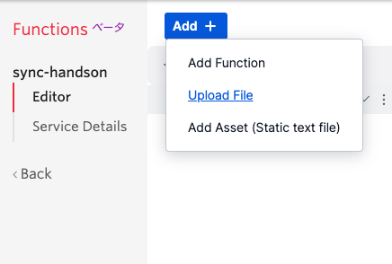
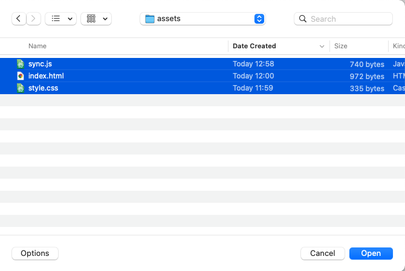
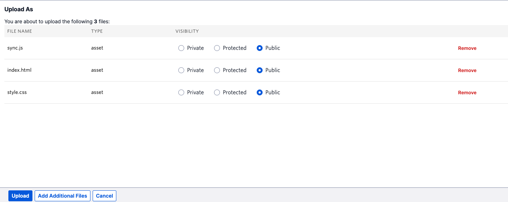
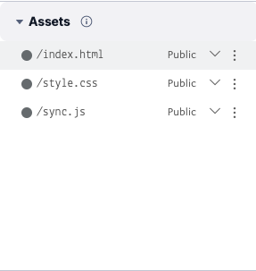
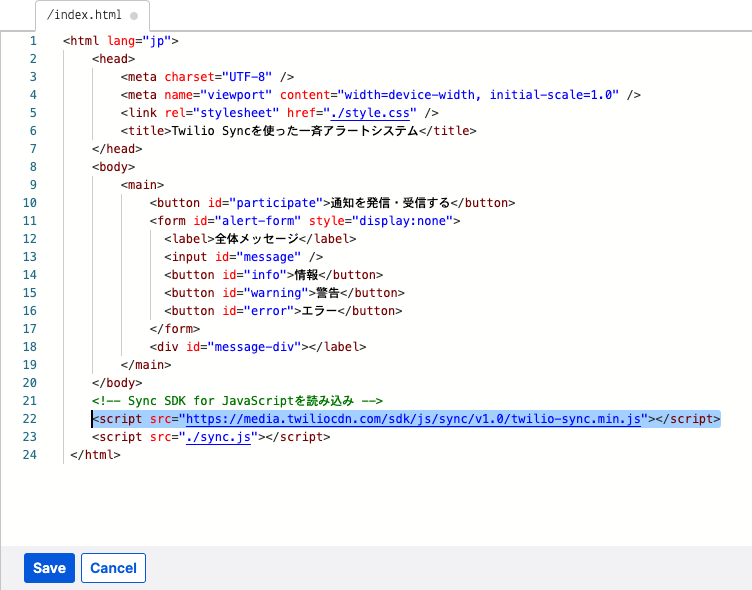
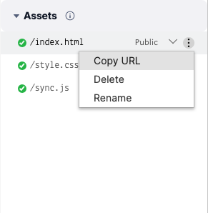

#  手順1: クライアントアプリケーションの初期化

この手順ではTwilio Functionsにファイルを追加し、Syncを利用するクライアントアプリケーションの初期化を行ます。

## 1-1. ファイルをダウンロードし、Assetsに追加

[こちら](../../samples/assets.zip)からファイルをダウンロードし、圧縮ファイルを展開します。

先ほど作成したTwilio Functionsのコードエディタ画面を再度開き、`Add +`ボタンから`Upload File`を選択します。

先ほど展開したファイルを選択します。

`VISIBILITY`を全て`Public`とし、`Upload`ボタンでアップロードを行ないます。

`Assets`エリアにファイルが表示されていれば成功です。

## 1-2. Sync SDK for JavaScriptを読み込み

`index.html`をエディタで開き、22行目のコメントを解除し、Sync SDK for JavaScriptを読み込みます。

`Save`ボタンをクリックし、変更を反映させます。

## 1-3. 再度デプロイし、クライアントアプリケーションを表示

再度`Deploy All`ボタンで現時点のコードをデプロイし、`index.html`をブラウザで開きます。URLは先ほどと同様に`Copy URL`で取得できます。

下記スクリーンショットの内容が表示されていればデプロイが成功しています。

これでクライアントアプリケーションでSync SDKを利用できるようになりました。

## 次の手順

[手順2: トークンの取得とSyncクライアントの呼び出し](02-Initialize-Sync-Client.md)