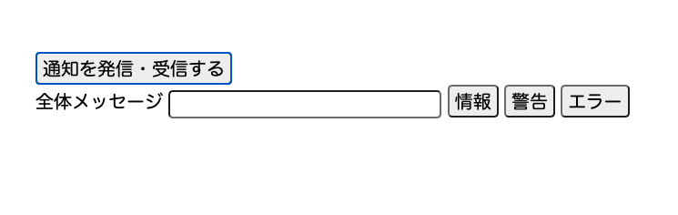

#  手順2: Syncクライアントの初期化

この手順ではクライアントアプリケーションで利用されている`sync.js`ファイルにコードを追加し、Syncクライアントを初期化します。


## 2-1. sync.jsを開き、トークンをリクエスト

`sync.js`ファイルを開き、`participate.addEventListener('click', async (event) => {});`の中身を実装します。

ここでは現時点の時刻から一意の識別子を作成し、Syncトークンをリクエストします。アクセストークンが応答として返されるため、トークンをコンソールに出力します。

```js
// 発信・受信ボタンがクリックされた際のイベントリスナー
participate.addEventListener('click', async (event) => {
    event.preventDefault();
    // 識別子を作成
    const identity = `user-${Date.now()}`;

    // Syncトークンをリクエスト
    let response = await fetch(url, {
        method: 'POST',
        headers: {
            'Content-Type' : 'application/json'
        },
        body: JSON.stringify({ identity: identity })
    });

    // レスポンスからトークンを取得
    let {token} = await response.json();

    // デバッグ目的でトークンを表示
    console.log(token);

});
```

## 2-2. Syncクライアントの初期化


次にSyncクライアントを初期化し、状態同期に使用する`Message`と名前をつけた`Document`オブジェクトをSyncサービスから取得します。

取得後はこのドキュメントが更新された際に発生する`updated`イベントをハンドルします。`updated`イベントではコンソールに情報を出力し、クライアント側のメッセージ表示領域を更新します。

```js

// 発信・受信ボタンがクリックされた際のイベントリスナー
participate.addEventListener('click', async (event) => {
    
    // ... 省略

    // 先ほど実装した箇所に引き続き下記のコードを追加

    // Syncクライアントを初期化
    syncClinet = new Twilio.Sync.Client(token);

    // MessageというSync Documentオブジェクトを取得
    syncClinet.document('Message')
        .then((document) => {
            
            // Documentを取得した後の処理
            // Documentオブジェクトが更新されたイベントの処理を実装
            document.on('updated', (event) => {
                // 更新された内容をコンソールに出力
                console.info(`Updated: ${event.data}`)
                
                // 全体メッセージのCSSとテキストを変更
                messageDiv.className = event.data.messageType
                messageDiv.innerText = event.data.message;
            });
        });

    // メッセージ送信フォームを表示
    alertForm.style.display = "";

});
```

## 2-3. 再デプロイを行ないクライアントアプリの動作を確認

再度デプロイし`index.html`を開きます。

`通知を発信・受信する`ボタンをクリックすると、追加の要素が画面に表示されることを確認してください。



この状態でSyncオブジェクトに更新があれば画面にその内容が表示されるようになっています。次の手順ではSyncオブジェクトの更新処理を実装します。

## 次の手順

[手順3: Syncオブジェクトの情報を更新](03-Update-Sync-Object.md)