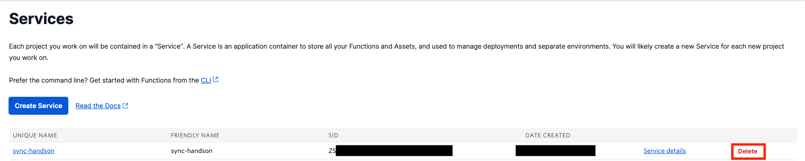
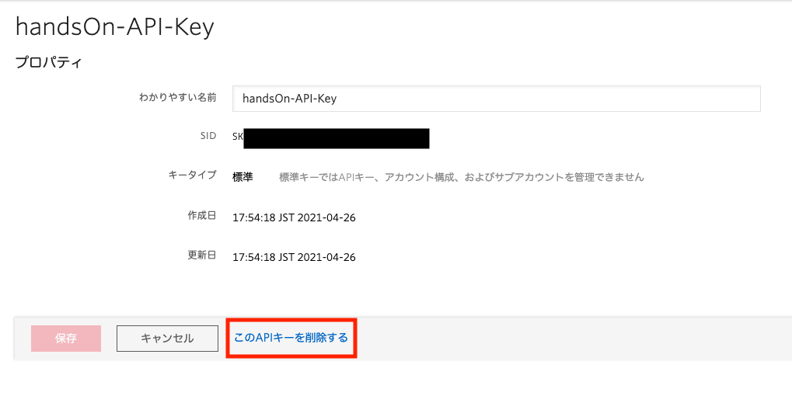
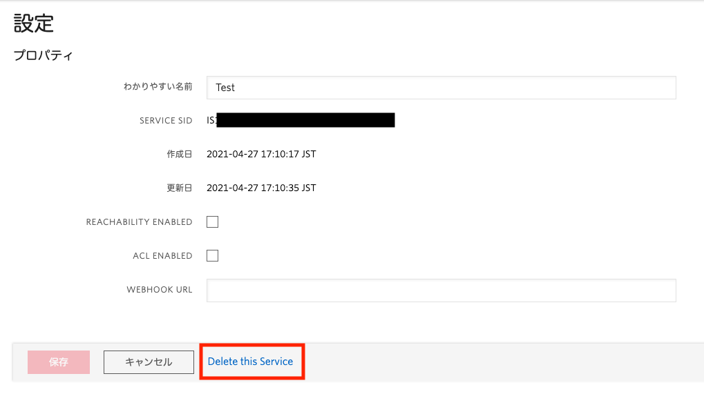

#  手順3: Syncオブジェクトの情報を更新

この手順ではクライアントアプリケーションからSyncオブジェクトを更新する処理を実装します。この処理により同じオブジェクトの購読を実施しているアプリケーションに同じ情報を送信できるようになります。

## 3-1. メッセージ送信の仕組みを実装

続けて`sync.js`ファイルを開き、`alertForm.addEventListener('submit', async (event) => { });`の中身を実装します。

このイベントリスナーでは、HTML要素から入力された値を取得し、Syncオブジェクトを更新します。

```js
alertForm.addEventListener('submit', async (event) => {
    event.preventDefault();

    // 情報の種類ならびにメッセージ内容を取得
    const submitId = event.submitter.id;
    const message = messageField.value;

    // Syncクライアントを使用し、同期するデータを更新
    syncClinet.document('Message')
        .then((document) => {
            document.update({
                messageType: submitId,
                message: message
            });
        });
});
```

## 3-2. 最終デプロイを実施し、アプリケーションの動作を確認

最終デプロイを実行し、複数タブでアプリケーションを起動します。1つのクライアントアプリケーションから発行したメッセージが他のアプリケーションにも反映されていることを確認してください。

## 次のステップ

これで基本的なSyncの処理を実装できました。このようにSyncを利用し複数の端末で同じ情報を共有できるようになります。

実開発においては、下記のリソースも参考にしてください。
- [Syncオブジェクトの生存期間（英語）](https://jp.twilio.com/docs/sync/objects-ttl)
- [Syncの制限（英語）](https://jp.twilio.com/docs/sync/limits)
- [Syncのセキュリティ（英語）](https://jp.twilio.com/docs/sync/permissions-and-access-control)


## 今回のハンズオンをクリーンアップ

今回のハンズオンで使用したリソースをクリアする場合は次の手順を実施してください。


[Twilio Functionsのサービス一覧](https://jp.twilio.com/console/functions/overview/services)画面で削除したいサービスの`Delete`ボタンをクリックし、サーバーレス実行環境を削除します。



[APIキー](https://jp.twilio.com/console/project/api-keys)画面で削除したいキーを選択し、詳細画面で`このAPIキーを削除する`リンクをクリックし、APIキーを削除します。



[Twilio Syncのサービス一覧](https://jp.twilio.com/console/sync/services)で削除したいサービスを選択し、詳細画面で`Delete this Service`リンクをクリックし、サービスを削除します。



`Default Service`を使用している場合かつ、他で利用していない場合は、`このServiceをリセットする`リンクをクリックし内容をクリアできます。